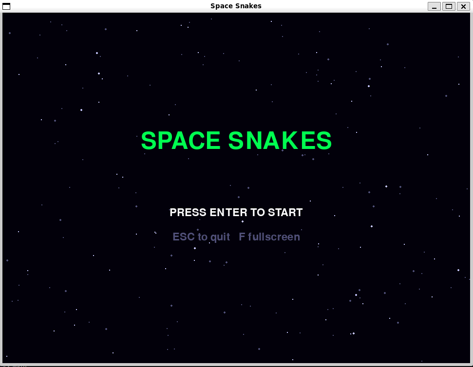
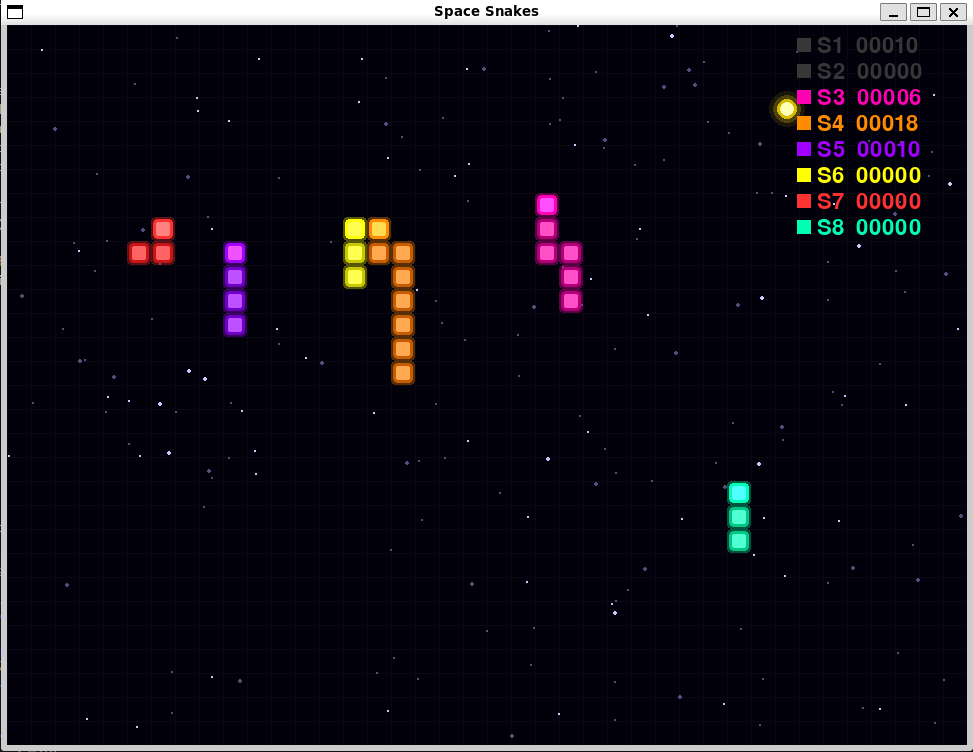

# Space Snakes

> 16-bit retro snake with neon laser visuals, set in the cosmos.




## Features

- [x] Neon laser snake with glow effect
- [x] Scrolling starfield background
- [x] Retro pixel font UI
- [x] Main menu + game over screen
- [x] WASD / arrow key controls
- [ ] Sound effects & chiptune music
- [ ] Background themes (nebula, asteroid field)
- [ ] Multiple snake skins / colors
- [ ] Power-ups (speed boost, shield)
- [ ] High score persistence
- [ ] Particle effects
- [ ] Local multiplayer

## Requirements

- Python 3.10+
- pygame 2.x

## Dependencies

```
pygame>=2.1.0
```

Install (WSL / Ubuntu — avoids SDL build errors):

```bash
sudo apt install python3-pygame
```

Or via pip (requires SDL dev libs):

```bash
sudo apt install libsdl2-dev libsdl2-image-dev libsdl2-mixer-dev libsdl2-ttf-dev
pip3 install -r requirements.txt
```

## Running the Game

```bash
python3 main.py
```

## Controls

| Key | Action |
|---|---|
| Arrow keys / WASD | Move snake |
| P | Pause |
| R | Restart (on game over) |
| F | Toggle fullscreen |
| ESC | Quit / back to menu |

## WSL / Linux Display Note

If running under WSL without WSLg, you need an X server running and:

```bash
export DISPLAY=:0
python main.py
```
